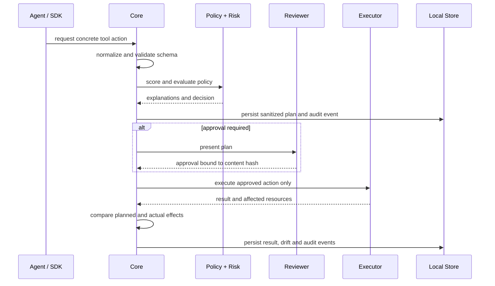

# Architecture

## Goals

AgentPlan is a planning, authorization and audit layer for side-effecting agent actions. It is local-first, provider-agnostic and framework-agnostic. The primary invariant is:

> An executor must not run an action unless that concrete action is represented in the current approved plan and the approval still matches the plan content hash.

## Package boundaries

```text
packages/core              framework-independent model, schemas, policy, risk, approval, audit, store
packages/sdk               application-facing generic tool wrapper
packages/adapter-filesystem workspace-safe file executor
packages/adapter-shell     argv-only process executor
packages/adapter-http      bounded HTTP executor with SSRF checks
packages/adapter-mcp       MCP discovery and gateway primitives
packages/adapter-openai    OpenAI payload normalizer
packages/adapter-anthropic Anthropic payload normalizer
apps/cli                   command parsing, terminal rendering, child-process runner
apps/dashboard             local HTTP dashboard exposing sanitized views
```

`@agentplan/core` does not import the CLI, dashboard, a provider SDK or an LLM. Executors implement the `ActionExecutor` interface and are injected into apply.

## Request lifecycle



## Canonical action model

Actions have an ID, plan ID, sequence, source, type, resource, sanitized input, effects, permissions, reversibility, risk, policy results and timestamps. Status is explicit and never inferred from prose. Raw provider payloads remain adapter-owned; the core only accepts normalized data.

## Plan integrity

The content hash covers stable, immutable plan content: plan identity, schema version, agent, environment, policy snapshot and action content including sanitized input, resource, type, effects, permissions and risk. Mutable lifecycle fields such as status, timestamps, approval and execution results are excluded. This lets an approved plan move through `approved → applying → completed` without changing its identity while making action edits detectable.

Approval records contain the plan hash, approver, method, action IDs, creation time, expiration and optional comment. Apply verifies the stored hash and expiration before selecting executors.

## Storage

The MVP uses `PlanStore`, implemented by `FilePlanStore` with JSON plans and JSONL audit files under `.agentplan/`. Writes use a temporary file and rename for plan documents. A future SQLite implementation can replace the store without changing the core engine boundary.

## Trust boundaries

- The agent and provider payload are untrusted input.
- Adapters are trusted to normalize but not to bypass policy; their outputs are re-evaluated by core.
- Policy configuration is a high-impact local authority and must be reviewed like code.
- Approval is a human or external authority boundary.
- Executors are side-effecting capabilities and are injected only at apply time.
- The dashboard is a read-only local view and must not be treated as an authenticated control plane.

See the ADRs in `docs/adr/` for decisions about the monorepo, model, policy, integrity, storage and providers.
