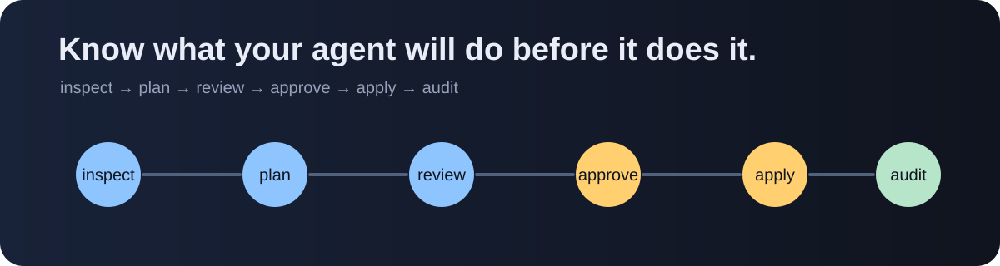
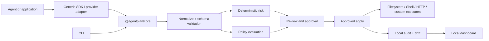

# AgentPlan

[English](README.md) | [Português do Brasil](README.pt-BR.md)



**Terraform Plan for AI agents.**

Inspect, review and approve agent actions before they affect real systems.

AgentPlan is provider-agnostic, framework-agnostic, local-first infrastructure for planning, authorizing and auditing actions with real side effects. It makes the distinction between what an agent requested, what it may be capable of, what it declared in prose, what a human approved and what actually executed.

The English README is the canonical source; the [Brazilian Portuguese README](README.pt-BR.md) mirrors its essential guidance for local developers.

> Early release: `0.1.0`. The core and CLI are functional; external provider adapters are normalizers, not API clients, and the dashboard is intentionally local-only.

## The problem

An agent can read and modify files, execute commands, call APIs, change databases, create commits, send messages or invoke MCP tools. Traditional logs tell you what happened after the fact. Prompt text tells you what the agent said it intended to do. Neither gives a trustworthy authorization boundary for the next side effect.

AgentPlan inserts a reviewable control point:

```text
inspect → plan → review → approve → apply → audit
```

The core does not pretend to predict an agent's entire future. A concrete plan contains requested actions that already exist. Estimated capabilities describe available tools and permissions. Declared intent remains explicitly uncommitted until a real tool call becomes a plan action.

## What is included

- A strict TypeScript core with runtime schemas for actions, plans, policies, approvals, results and drift.
- Deterministic, explainable risk scoring with configurable thresholds and reasons.
- Deny-by-default policy evaluation for workspace paths, shell commands, network hosts, databases, Git, financial operations and MCP.
- Plan integrity hashes bound to approvals; changing immutable plan content invalidates approval.
- Interactive approval, pre-approved low-risk actions and an external approval interface.
- Sanitized JSONL audit events and local JSON plan storage with no remote telemetry by default.
- Workspace-bound filesystem, non-shell-spawning shell and SSRF-aware HTTP executors.
- Generic SDK tools, MCP discovery/interception primitives, and OpenAI/Anthropic tool-call normalizers.
- JSON-capable CLI, local dashboard, executable examples, security-focused tests, capability diffs, SARIF export and GitHub review integration.

## Five-minute demo

Requirements: Node.js 20.19+ and pnpm 11+.

```bash
pnpm install
pnpm build
pnpm exec agentplan inspect
pnpm exec agentplan run -- node examples/file-agent/index.mjs
```

The example reads an allowed fixture automatically, then pauses before writing `examples/file-agent/data/output.txt`. Type `A` to approve. The plan, approval, execution result and audit trail are written under `.agentplan/`.

To inspect the same flow in CI-safe mode, approval is refused rather than bypassed:

```bash
pnpm exec agentplan run --non-interactive -- node examples/file-agent/index.mjs
```

To see a policy block without executing a destructive command:

```bash
pnpm exec agentplan policy check --input examples/actions/dangerous-shell.yaml
```

The command reports `shell.deny[0]`, a critical risk score and exit code `6`. No `rm` process is started.

For a plan-first workflow:

```bash
pnpm exec agentplan plan --input examples/actions/file-write.yaml
# Copy the printed plan id.
pnpm exec agentplan approve <PLAN_ID>
pnpm exec agentplan apply <PLAN_ID>
pnpm exec agentplan audit show <PLAN_ID>
```

## Installation

For repository development:

```bash
pnpm install
pnpm build
```

The published CLI package will be installable with the normal npm/pnpm package workflow when released. Until then, `pnpm exec agentplan` runs the workspace CLI after `pnpm build`.

Initialize a new project from an empty directory:

```bash
pnpm exec agentplan init
pnpm exec agentplan doctor
```

`init` creates `agentplan.yaml`, `.agentplan/` and recommended `.gitignore` entries. It never overwrites an existing configuration unless `--force` is supplied.

## CLI

```text
agentplan init
agentplan inspect
agentplan run -- node agent.js
agentplan plan --input actions.yaml
agentplan approve <plan-id>
agentplan deny <plan-id>
agentplan apply <plan-id>
agentplan show [plan-id]
agentplan diff --from <plan-id> --to <plan-id>
agentplan capabilities diff --before <file> --after <file> [--sarif <file>]
agentplan policy check --input actions.yaml
agentplan audit list
agentplan audit show <plan-id>
agentplan doctor
agentplan dashboard
agentplan version
```

Relevant commands accept `--json`, `--quiet`, `--config`, `--no-color` and `--non-interactive`. Exit codes are documented in [docs/cli.md](docs/cli.md).

Capability snapshots can be compared in CI. New permissions, external hosts and destructive capabilities are classified deterministically and can be exported as SARIF. The local GitHub Action compares the pull request configuration with its base branch, optionally updates one capability comment and fails on critical additions.

See [GitHub integration](docs/github.md) for the Action and the hash-bound `GitHubApprovalAdapter`.

## Architecture



The core has no dependency on the CLI, dashboard or an LLM provider. Adapters convert provider-specific events into the canonical action model; they do not silently call external APIs.

## Action states and honesty model

Every action can be `requested`, `estimated`, `declared`, `approved`, `denied`, `executed`, `blocked`, `failed` or `skipped`. The MVP creates concrete `requested` actions from SDK calls and plan documents. Capability inspection is reported separately. No declared prose is promoted to an executed action.

## Security model

AgentPlan is a control point, not a universal sandbox. Its default posture is:

- deny by default and least privilege;
- validate paths within a configured workspace and reject external symlinks;
- execute shell argv with `shell: false` and bounded time/output;
- reject private-network HTTP targets and private DNS resolutions, plus unknown hosts unless explicitly approved;
- redact secrets before terminal output, audit storage and dashboard responses;
- bind approvals to a SHA-256 content hash and expiration;
- execute only actions present in the approved plan;
- record policy explanations, approval metadata, results and drift.

The shell executor also rejects dangerous environment overrides such as `PATH`, `NODE_OPTIONS` and `GIT_SSH_COMMAND`, and the local JSON store is created with owner-only permissions where the operating system supports them.

Read [SECURITY.md](SECURITY.md) and the [threat model](docs/security/threat-model.md) before connecting an agent to production systems.

## Dashboard

Start the local dashboard after building:

```bash
pnpm exec agentplan dashboard
```

Open `http://127.0.0.1:4321`. The dashboard reads local plans and exposes sanitized action details, policy results, approval, execution and drift. It has no remote telemetry or authentication layer in this MVP; bind it only to a trusted local interface.

## Examples

- [File agent](examples/file-agent/index.mjs): allowed read, reviewed write and audit.
- [Shell agent](examples/shell-agent/index.mjs): command execution through argv, approval-required install preview and a blocked destructive command.
- [Support agent](examples/support-agent/index.mjs): simulated ticket lookup and refund threshold policy; no payment provider is called.
- [MCP agent](examples/mcp-agent/index.mjs): tool discovery, intercepted invocation, approval and simulated execution.
- [CLI action documents](examples/actions): plan files for filesystem and shell policy checks.

See [docs/examples.md](docs/examples.md) for expected output and non-interactive variants.

## Risk scoring

Risk is deterministic and explainable. The score starts with an action-type baseline, then adds documented factors for irreversibility, production targets, sensitive data, destructive commands, external networks, shell composition, financial amounts, affected volume and configured weights. Thresholds map scores to low, medium, high and critical. See [docs/risk-model.md](docs/risk-model.md).

## Limitations

The MVP does not provide universal OS sandboxing, perfect future-chain prediction, guaranteed rollback, a full MCP implementation, complete provider API clients, distributed execution, enterprise identity, billing or a marketplace. SQLite storage, remote approvals beyond GitHub issue comments and a richer dashboard are planned extensions. Read [docs/limitations.md](docs/limitations.md) for the threat boundary and safe deployment guidance.

## Roadmap

1. Foundation: schemas, policy, risk, redaction, audit and integrity.
2. Functional CLI: plan, approve, apply, diff and doctor.
3. Core adapters: filesystem, shell, HTTP and SDK.
4. Agent integrations: MCP gateway and provider event coverage.
5. Developer experience: examples, dashboard, GitHub Action and SARIF.
6. Public release: packaging, security review, documentation and community feedback.

The detailed roadmap is in [ROADMAP.md](ROADMAP.md).

## Development

```bash
pnpm typecheck
pnpm test
pnpm build
pnpm check:docs
pnpm check:examples
```

Tests use temporary directories and mocks. They do not perform real charges, refunds, destructive deletes or external provider calls.

The CI smoke test runs the compiled CLI and dashboard against a temporary workspace. It exercises initialization, policy blocking, plan/approve/apply, a real workspace write and dashboard API reads without contacting external providers.

Read [CONTRIBUTING.md](CONTRIBUTING.md) before opening a pull request. Technical documentation, code, tests, issue templates and commit messages use English; community issues and discussions may be written in English or Brazilian Portuguese.

## License

AgentPlan is released under the [Apache License 2.0](LICENSE). It is independent infrastructure and is not affiliated with or endorsed by any model provider.
