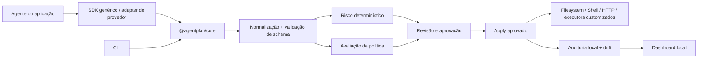

# AgentPlan

[English](README.md) | [Português do Brasil](README.pt-BR.md)


**Terraform Plan para agentes de IA.**

Inspecione, revise e aprove as ações de um agente antes que elas afetem sistemas reais.

O AgentPlan é uma infraestrutura local-first, neutra em relação a provedores e frameworks, para planejar, autorizar e auditar ações com efeitos colaterais reais. Ele diferencia o que o agente solicitou, o que ele pode ser capaz de fazer, o que declarou em texto, o que uma pessoa aprovou e o que de fato foi executado.

O README em inglês é a fonte canônica; este arquivo acompanha suas orientações essenciais para desenvolvedores brasileiros.

> Versão inicial: `0.1.0`. O core e a CLI são funcionais; os adapters de provedores são normalizadores, não clientes de API, e o dashboard é deliberadamente local.

## O problema

Um agente pode ler e modificar arquivos, executar comandos, chamar APIs, alterar bancos de dados, criar commits, enviar mensagens ou invocar ferramentas MCP. Logs tradicionais mostram o que aconteceu depois. O texto do prompt mostra o que o agente disse que pretendia fazer. Nenhum dos dois cria, por si só, um limite confiável de autorização para o próximo efeito colateral.

O AgentPlan insere um ponto de controle revisável:

```text
inspect → plan → review → approve → apply → audit
```

O core não finge prever toda a sequência futura de um agente. Um plano concreto contém ações solicitadas que já existem. Capacidades estimadas descrevem ferramentas e permissões disponíveis. A intenção declarada permanece explicitamente não comprometida até virar uma chamada real de ferramenta.

## O que está incluído

- Core TypeScript estrito, com schemas de runtime para ações, planos, políticas, aprovações, resultados e drift.
- Classificação de risco determinística, explicável e configurável.
- Políticas deny-by-default para caminhos do workspace, comandos shell, hosts de rede, bancos, Git, operações financeiras e MCP.
- Hash de integridade vinculado à aprovação; alterar o conteúdo imutável invalida a aprovação.
- Aprovação interativa, pré-aprovação de ações de baixo risco e interface para adaptadores externos.
- Auditoria JSONL sanitizada e armazenamento JSON local, sem telemetria remota por padrão.
- Executors reais para filesystem limitado ao workspace, shell sem spawn de shell e HTTP com proteção contra SSRF.
- SDK genérico, primitives de descoberta/interceptação MCP e normalizadores de chamadas de ferramentas OpenAI/Anthropic.
- CLI com saída JSON, dashboard local, exemplos executáveis, testes de segurança, diffs de capacidades, exportação SARIF e integração de revisão via GitHub.

## Demonstração em cinco minutos

Requisitos: Node.js 20.19+ e pnpm 11+.

```bash
pnpm install
pnpm build
pnpm exec agentplan inspect
pnpm exec agentplan run -- node examples/file-agent/index.mjs
```

O exemplo lê automaticamente um fixture permitido e pausa antes de escrever `examples/file-agent/data/output.txt`. Digite `A` para aprovar. O plano, a aprovação, o resultado da execução e a trilha de auditoria são gravados em `.agentplan/`.

Para verificar o mesmo fluxo em CI, a aprovação é recusada em vez de ser ignorada:

```bash
pnpm exec agentplan run --non-interactive -- node examples/file-agent/index.mjs
```

Para visualizar um bloqueio de política sem executar um comando destrutivo:

```bash
pnpm exec agentplan policy check --input examples/actions/dangerous-shell.yaml
```

O comando informa `shell.deny[0]`, risco crítico e código de saída `6`. Nenhum processo `rm` é iniciado.

Fluxo explícito de plano, aprovação e aplicação:

```bash
pnpm exec agentplan plan --input examples/actions/file-write.yaml
# Copie o plan id exibido.
pnpm exec agentplan approve <PLAN_ID>
pnpm exec agentplan apply <PLAN_ID>
pnpm exec agentplan audit show <PLAN_ID>
```

## Instalação

Para desenvolvimento do repositório:

```bash
pnpm install
pnpm build
```

Quando publicado, o pacote da CLI poderá ser instalado pelo fluxo normal de npm/pnpm. Enquanto isso, `pnpm exec agentplan` executa a CLI do workspace depois de `pnpm build`.

Para inicializar um projeto novo em um diretório vazio:

```bash
pnpm exec agentplan init
pnpm exec agentplan doctor
```

O `init` cria `agentplan.yaml`, `.agentplan/` e recomendações para `.gitignore`. Ele nunca sobrescreve uma configuração existente sem `--force` explícito.

## CLI

```text
agentplan init
agentplan inspect
agentplan run -- node agent.js
agentplan plan --input actions.yaml
agentplan approve <plan-id>
agentplan deny <plan-id>
agentplan apply <plan-id>
agentplan show [plan-id]
agentplan diff --from <plan-id> --to <plan-id>
agentplan capabilities diff --before <file> --after <file> [--sarif <file>]
agentplan policy check --input actions.yaml
agentplan audit list
agentplan audit show <plan-id>
agentplan doctor
agentplan dashboard
agentplan version
```

Os comandos relevantes aceitam `--json`, `--quiet`, `--config`, `--no-color` e `--non-interactive`. Os códigos de saída estão documentados em [docs/cli.md](docs/cli.md).

Snapshots de capacidades podem ser comparados no CI. Novas permissões, hosts externos e capacidades destrutivas são classificados de forma determinística e podem ser exportados em SARIF. A GitHub Action local compara a configuração do pull request com a branch base, pode atualizar um comentário de capacidades e falha quando encontra novas capacidades críticas.

Veja [integração com GitHub](docs/github.md) para configurar a Action e o `GitHubApprovalAdapter`, que vincula a aprovação ao hash do plano.

## Arquitetura



O core não depende da CLI, do dashboard nem de um provedor de LLM. Adapters convertem eventos específicos de cada provedor para o modelo canônico de ações; eles não chamam APIs externas silenciosamente.

## Estados das ações e honestidade técnica

Cada ação pode estar em `requested`, `estimated`, `declared`, `approved`, `denied`, `executed`, `blocked`, `failed` ou `skipped`. O MVP cria ações concretas `requested` a partir de chamadas do SDK e de documentos de plano. A inspeção de capacidades é apresentada separadamente. Texto declarado nunca é promovido a ação executada.

## Modelo de segurança

O AgentPlan é um ponto de controle, não um sandbox universal. A postura padrão é:

- negar por padrão e aplicar o menor privilégio;
- validar caminhos dentro do workspace e rejeitar symlinks externos;
- executar argv com `shell: false`, além de limitar tempo e saída;
- rejeitar destinos HTTP privados e hosts desconhecidos até haver aprovação explícita;
- mascarar segredos antes do terminal, da auditoria e das respostas do dashboard;
- vincular aprovações a hash SHA-256 e expiração;
- executar somente ações presentes no plano aprovado;
- registrar explicações de política, metadados de aprovação, resultados e drift.

Leia [SECURITY.md](SECURITY.md) e o [modelo de ameaças](docs/security/threat-model.md) antes de conectar um agente a sistemas de produção.

## Dashboard

Inicie o dashboard local depois do build:

```bash
pnpm exec agentplan dashboard
```

Abra `http://127.0.0.1:4321`. O dashboard lê planos locais e exibe detalhes sanitizados das ações, políticas, aprovação, execução e drift. Não há telemetria remota nem autenticação no MVP; mantenha o bind em uma interface local confiável.

## Exemplos

- [File agent](examples/file-agent/index.mjs): leitura permitida, escrita revisada e auditoria.
- [Shell agent](examples/shell-agent/index.mjs): execução por argv, instalação que exige aprovação e comando destrutivo bloqueado.
- [Support agent](examples/support-agent/index.mjs): consulta simulada e política de limite de reembolso; nenhum provedor de pagamento é chamado.
- [MCP agent](examples/mcp-agent/index.mjs): descoberta, interceptação, aprovação e execução simulada.
- [Documentos de ações da CLI](examples/actions): arquivos de plano para filesystem e verificação de política shell.

Veja [docs/examples.md](docs/examples.md) para a saída esperada e variantes não interativas.

## Cálculo de risco

O risco é determinístico e explicável. O score começa com um valor-base por tipo de ação e soma fatores documentados para irreversibilidade, produção, dados sensíveis, comandos destrutivos, redes externas, composição shell, valores financeiros, volume afetado e pesos configurados. Limites transformam o score em low, medium, high ou critical. Veja [docs/risk-model.md](docs/risk-model.md).

## Limitações

O MVP não oferece sandbox universal para todos os sistemas operacionais, previsão perfeita da cadeia futura, rollback garantido, implementação completa de MCP, clientes completos das APIs de provedores, execução distribuída, identidade empresarial, billing ou marketplace. Storage SQLite, aprovações remotas além de comentários no GitHub e um dashboard mais rico são extensões planejadas. Consulte [docs/limitations.md](docs/limitations.md) para conhecer a fronteira de segurança e orientações de uso.

## Roadmap

1. Foundation: schemas, política, risco, redaction, auditoria e integridade.
2. CLI funcional: plan, approve, apply, diff e doctor.
3. Adapters principais: filesystem, shell, HTTP e SDK.
4. Integrações de agentes: gateway MCP e cobertura de eventos dos provedores.
5. Experiência de desenvolvimento: exemplos, dashboard, GitHub Action e SARIF.
6. Publicação: pacotes, revisão de segurança, documentação e comunidade.

O roadmap detalhado está em [ROADMAP.md](ROADMAP.md).

## Desenvolvimento

```bash
pnpm typecheck
pnpm test
pnpm build
pnpm check:docs
pnpm check:examples
```

Os testes usam diretórios temporários e mocks. Eles não fazem cobranças, reembolsos, exclusões destrutivas nem chamadas a provedores externos.

Leia [CONTRIBUTING.md](CONTRIBUTING.md) antes de abrir um pull request. Código, testes, documentação técnica, templates de issue e mensagens de commit usam inglês; issues e discussões da comunidade podem ser escritas em inglês ou português brasileiro.

## Licença

O AgentPlan é distribuído sob a [Apache License 2.0](LICENSE). É uma infraestrutura independente e não é afiliada nem endossada por nenhum provedor de modelos.
